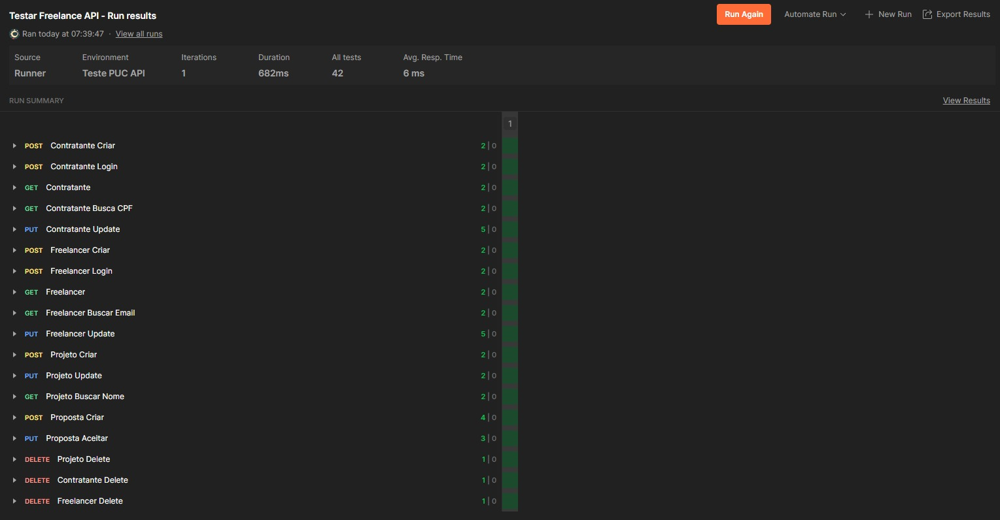

# APIs e Web Services

O planejamento de uma aplicação de APIs Web é uma etapa fundamental para o sucesso do projeto. Ao planejar adequadamente, você pode evitar muitos problemas e garantir que a sua API seja segura, escalável e eficiente.

Aqui estão algumas etapas importantes que devem ser consideradas no planejamento de uma aplicação de APIs Web.

## Objetivos da API

O primeiro passo é definir os objetivos da sua API. O que você espera alcançar com ela? Você quer que ela seja usada por clientes externos ou apenas por aplicações internas? Quais são os recursos que a API deve fornecer?

Os objetivos da API são:
- Permitir que contratantes cadastrem e gerenciem projetos.
- Permitir que freelancers busquem e façam propostas para projetos.
- Autenticar usuários (contratantes e freelancers) e fornecer tokens de acesso.

## Modelagem da Aplicação

A modelagem da aplicação inclui a estrutura de dados, diagramas de classes ou entidades, e outras representações visuais relevantes.

### Estrutura de Dados

- **UsuarioBase**: Classe base para usuários, contendo propriedades comuns como `Id` e `Email`.
- **Contratante**: Herda de `UsuarioBase`, representa um contratante que pode cadastrar projetos.
- **Freelancer**: Herda de `UsuarioBase`, representa um freelancer que pode fazer propostas para projetos.
- **Projeto**: Representa um projeto cadastrado por um contratante.
- **Proposta**: Representa uma proposta feita por um freelancer para um projeto.

## Tecnologias Utilizadas

- **C#**: Linguagem de programação principal.
- **ASP.NET Core**: Framework para construção de APIs Web.
- **Entity Framework Core**: ORM para acesso ao banco de dados.
- **AutoMapper**: Biblioteca para mapeamento de objetos.
- **JWT**: Para autenticação e geração de tokens.

## API Endpoints

### Contratante

- **POST /api/contratante/login**
  - Autentica um contratante e retorna um token de acesso.
  - Parâmetros: `LoginRequest`
  - Resposta: `LoginResponse`

- **POST /api/contratante**
  - Cadastra um novo contratante.
  - Parâmetros: `ContratanteDTO`
  - Resposta: `Contratante`

- **GET /api/contratante/{id}**
  - Busca um contratante pelo ID.
  - Parâmetros: `id`
  - Resposta: `Contratante`

- **GET /api/contratante/buscar-por-cpf/{cpf}**
  - Busca um contratante pelo CPF.
  - Parâmetros: `cpf`
  - Resposta: `Contratante`

- **GET /api/contratante**
  - Lista todos os contratantes.
  - Resposta: `IEnumerable<Contratante>`

- **PUT /api/contratante/{id}**
  - Atualiza um contratante.
  - Parâmetros: `ContratanteUpdateDTO`, `id`
  - Resposta: `Contratante`

- **DELETE /api/contratante/{id}**
  - Exclui um contratante.
  - Parâmetros: `id`
  - Resposta: `void`

### Freelancer

- **POST /api/freelancer/login**
  - Autentica um freelancer e retorna um token de acesso.
  - Parâmetros: `LoginRequest`
  - Resposta: `LoginResponse`

- **POST /api/freelancer**
  - Cadastra um novo freelancer.
  - Parâmetros: `FreelancerDTO`
  - Resposta: `Freelancer`

- **GET /api/freelancer/{id}**
  - Busca um freelancer pelo ID.
  - Parâmetros: `id`
  - Resposta: `Freelancer`

- **GET /api/freelancer/buscar-por-email/{email}**
  - Busca um freelancer pelo email.
  - Parâmetros: `email`
  - Resposta: `Freelancer`

- **GET /api/freelancer**
  - Lista todos os freelancers.
  - Resposta: `IEnumerable<Freelancer>`

- **PUT /api/freelancer/{id}**
  - Atualiza um freelancer.
  - Parâmetros: `FreelancerUpdateDTO`, `id`
  - Resposta: `Freelancer`

- **DELETE /api/freelancer/{id}**
  - Exclui um freelancer.
  - Parâmetros: `id`
  - Resposta: `void`

### Projeto

- **POST /api/projeto**
  - Cadastra um novo projeto.
  - Parâmetros: `ProjetoCadastroDTO`
  - Resposta: `ProjetoResponseDTO`

- **GET /api/projeto/{id:long}**
  - Busca um projeto pelo ID.
  - Parâmetros: `id`
  - Resposta: `Projeto`

- **GET /api/projeto/categoria/{categoria}**
  - Busca projetos por categoria.
  - Parâmetros: `categoria`
  - Resposta: `IEnumerable<Projeto>`

- **GET /api/projeto/nome/{nome}**
  - Busca projetos por nome.
  - Parâmetros: `nome`
  - Resposta: `Projeto`

- **GET /api/projeto**
  - Lista todos os projetos.
  - Resposta: `IEnumerable<Projeto>`

- **PUT /api/projeto/{id}**
  - Atualiza um projeto.
  - Parâmetros: `ProjetoCadastroDTO`, `id`
  - Resposta: `Projeto`

- **DELETE /api/projeto/{id:long}**
  - Exclui um projeto.
  - Parâmetros: `id`
  - Resposta: `void`

### Proposta

- **POST /api/proposta**
  - Cadastra uma nova proposta.
  - Parâmetros: `PropostaCadastroDTO`
  - Resposta: `PropostaResponseDTO`

- **GET /api/proposta/proposta-por-freelancer/{nomeFreelancer}-{nomeProjeto}**
  - Busca uma proposta por freelancer e projeto.
  - Parâmetros: `nomeFreelancer`, `nomeProjeto`
  - Resposta: `Proposta`

- **PUT /api/proposta/aceitar-proposta/{propostaId}**
  - Aceita uma proposta.
  - Parâmetros: `propostaId`
  - Resposta: `Proposta`

## Considerações de Segurança

- **Autenticação**: Utilização de JWT para autenticação e autorização.
- **Autorização**: Políticas de autorização para diferentes tipos de usuários (contratantes e freelancers).
- **Proteção contra ataques**: Implementação de medidas de segurança como proteção contra ataques de força bruta e injeção de SQL.

## Implantação

1. Defina os requisitos de hardware e software necessários para implantar a aplicação em um ambiente de produção.
2. Escolha uma plataforma de hospedagem adequada, como um provedor de nuvem ou um servidor dedicado.
3. Configure o ambiente de implantação, incluindo a instalação de dependências e configuração de variáveis de ambiente.
4. Faça o deploy da aplicação no ambiente escolhido, seguindo as instruções específicas da plataforma de hospedagem.
5. Realize testes para garantir que a aplicação esteja funcionando corretamente no ambiente de produção.

## Testes

# 📋 Casos de Teste - API Freelance

## Autenticação

### Login Contratante
- **Objetivo**: Validar autenticação de contratante com credenciais válidas.
- **Método**: `POST /api/contratante/login`
- **Entrada**: `LoginRequest` com e-mail e senha válidos.
- **Resultado Esperado**: Status `200 OK`, token JWT válido retornado.

### Login Freelancer
- **Objetivo**: Validar autenticação de freelancer com credenciais válidos.
- **Método**: `POST /api/freelancer/login`
- **Entrada**: `LoginRequest` com e-mail e senha válidos.
- **Resultado Esperado**: Status `200 OK`, token JWT válido retornado.

## Contratante

### Cadastrar Contratante
- **Objetivo**: Criar um novo contratante.
- **Método**: `POST /api/contratante`
- **Entrada**: `ContratanteDTO` com dados válidos.
- **Resultado Esperado**: Status `201 Created`, retorno do contratante criado.

### Buscar por ID
- **Objetivo**: Obter dados de contratante por ID.
- **Método**: `GET /api/contratante/{id}`
- **Resultado Esperado**: Status `200 OK`, objeto contratante correspondente.

### Buscar por CPF
- **Objetivo**: Obter dados de contratante pelo CPF.
- **Método**: `GET /api/contratante/buscar-por-cpf/{cpf}`
- **Resultado Esperado**: Status `200 OK`, objeto contratante correspondente.

### Atualizar Contratante
- **Objetivo**: Alterar dados de um contratante.
- **Método**: `PUT /api/contratante/{id}`
- **Entrada**: `ContratanteUpdateDTO`
- **Resultado Esperado**: Status `200 OK`, dados atualizados retornados.

### Deletar Contratante
- **Objetivo**: Remover contratante pelo ID.
- **Método**: `DELETE /api/contratante/{id}`
- **Resultado Esperado**: Status `204 No Content`.

## Freelancer

### Cadastrar Freelancer
- **Objetivo**: Criar um novo freelancer.
- **Método**: `POST /api/freelancer`
- **Entrada**: `FreelancerDTO` com dados válidos.
- **Resultado Esperado**: Status `201 Created`, retorno do freelancer criado.

### Buscar por ID
- **Objetivo**: Obter dados do freelancer por ID.
- **Método**: `GET /api/freelancer/{id}`
- **Resultado Esperado**: Status `200 OK`, dados do freelancer.

### Buscar por Email
- **Objetivo**: Obter freelancer pelo e-mail.
- **Método**: `GET /api/freelancer/buscar-por-email/{email}`
- **Resultado Esperado**: Status `200 OK`, objeto freelancer correspondente.

### Atualizar Freelancer
- **Objetivo**: Atualizar dados de um freelancer.
- **Método**: `PUT /api/freelancer/{id}`
- **Entrada**: `FreelancerUpdateDTO`
- **Resultado Esperado**: Status `200 OK`, dados atualizados.

### Deletar Freelancer
- **Objetivo**: Excluir freelancer pelo ID.
- **Método**: `DELETE /api/freelancer/{id}`
- **Resultado Esperado**: Status `204 No Content`.

## Projeto

### Cadastrar Projeto
- **Objetivo**: Criar novo projeto.
- **Método**: `POST /api/projeto`
- **Entrada**: `ProjetoCadastroDTO`
- **Resultado Esperado**: Status `201 Created`, retorno do projeto.

### Buscar por ID
- **Objetivo**: Obter projeto pelo ID.
- **Método**: `GET /api/projeto/{id}`
- **Resultado Esperado**: Status `200 OK`, objeto projeto.

### Buscar por Nome
- **Objetivo**: Localizar projeto pelo nome.
- **Método**: `GET /api/projeto/nome/{nome}`
- **Resultado Esperado**: Status `200 OK`, projeto correspondente.

### Buscar por Categoria
- **Objetivo**: Listar projetos de uma categoria.
- **Método**: `GET /api/projeto/categoria/{categoria}`
- **Resultado Esperado**: Status `200 OK`, lista de projetos.

### Atualizar Projeto
- **Objetivo**: Modificar um projeto existente.
- **Método**: `PUT /api/projeto/{id}`
- **Entrada**: `ProjetoCadastroDTO`
- **Resultado Esperado**: Status `200 OK`, projeto atualizado.

### Deletar Projeto
- **Objetivo**: Excluir um projeto.
- **Método**: `DELETE /api/projeto/{id}`
- **Resultado Esperado**: Status `204 No Content`.

## Proposta

### Cadastrar Proposta
- **Objetivo**: Criar uma nova proposta para um projeto.
- **Método**: `POST /api/proposta`
- **Entrada**: `PropostaCadastroDTO`
- **Resultado Esperado**: Status `201 Created`, proposta cadastrada.

### Buscar por Freelancer e Projeto
- **Objetivo**: Obter proposta específica de um freelancer para um projeto.
- **Método**: `GET /api/proposta/proposta-por-freelancer/{nomeFreelancer}-{nomeProjeto}`
- **Resultado Esperado**: Status `200 OK`, proposta correspondente.

### Aceitar Proposta
- **Objetivo**: Atualizar status de uma proposta para "aceita".
- **Método**: `PUT /api/proposta/aceitar-proposta/{propostaId}`
- **Resultado Esperado**: Status `200 OK`, proposta atualizada com status aceito.

## Referências

Inclua todas as referências (livros, artigos, sites, etc) utilizados no desenvolvimento do trabalho.